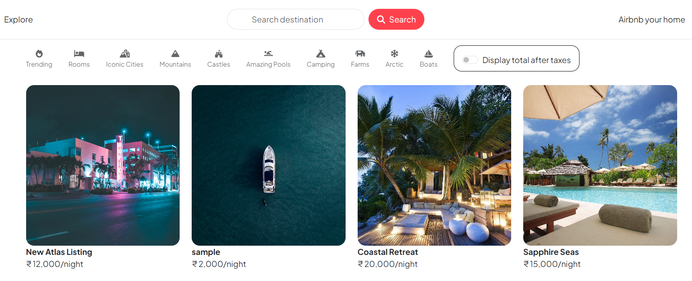

# Konkan Stay 🏖️


### 🌊 Discover Authentic Coastal Stays in Maharashtra's Konkan Region
### 🏡 A platform connecting travelers with unique beachside accommodations, homestays, and coastal experiences

## About Konkan Stay

Konkan Stay is a specialized accommodation platform focused on the beautiful Konkan coast of Maharashtra. From serene beach houses in Alibaug to traditional homestays in Ratnagiri, we help travelers discover authentic coastal experiences.

**Built with:** HTML, CSS, JavaScript, Node.js, Express.js, EJS, MongoDB, and lots of ❤️ for the Konkan coast!

## Features

- 🏖️ **Coastal Focus**: Specialized listings for beach houses, homestays, and coastal properties
- 🌅 **Local Experiences**: Discover authentic Konkan culture and cuisine
- 📱 **Responsive Design**: Works seamlessly on all devices
- 🔐 **Secure Authentication**: Safe login and booking system
- ⭐ **Reviews & Ratings**: Community-driven feedback system
- 📸 **Image Gallery**: Beautiful property photos with Cloudinary integration

## Popular Destinations

- **Alibaug** - Weekend beach getaways
- **Kashid** - Pristine white sand beaches  
- **Murud-Janjira** - Historic fort and coastal charm
- **Ganpatipule** - Spiritual and scenic beauty
- **Tarkarli** - Crystal clear waters and water sports
- **Ratnagiri** - Mango orchards and Alphonso heritage

## Tech Stack

- **Frontend**: HTML5, CSS3, JavaScript, Bootstrap 5
- **Backend**: Node.js, Express.js
- **Database**: MongoDB with Mongoose
- **Authentication**: Passport.js with local strategy
- **File Upload**: Multer with Cloudinary
- **Template Engine**: EJS with EJS-Mate

## Getting Started

1. Clone the repository
2. Install dependencies: `npm install`
3. Set up environment variables in `.env`
4. Run the application: `npm start`
5. Visit `http://localhost:8080`

## Environment Variables

```
ATLASDB_URL=your_mongodb_connection_string
SECRET=your_session_secret
CLOUD_NAME=your_cloudinary_cloud_name
CLOUD_API_KEY=your_cloudinary_api_key
CLOUD_API_SECRET=your_cloudinary_api_secret
```

---

*Made with 🌊 for the beautiful Konkan coast*